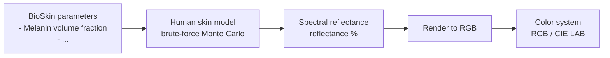
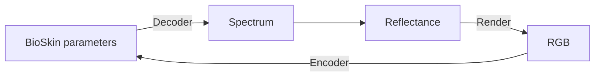

# BioSkin Forward and Inverse Pipeline

This note converts the handwritten sketch into a structured Markdown outline.

## 1. Forward Process

The forward process starts from **BioSkin parameters**, simulates skin reflectance using a human skin model, and then renders the reflectance spectrum into a color representation.



### Notes

- **Input:** BioSkin parameters, such as melanin volume fraction.
- **Model:** A human skin model based on brute-force Monte Carlo simulation.
- **Simulation idea:** Random walks inside the skin are used to estimate spectral reflectance.
- **Output spectrum:** Reflectance as a function of wavelength.
- **Rendering:** The spectral reflectance is converted into RGB or CIE LAB color values.

### Reflectance Curve

The sketch shows a typical reflectance curve:

- x-axis: wavelength, approximately from **380 nm to 1000 nm**.
- y-axis: reflectance percentage.
- The curve increases with wavelength.

```text
Reflectance (%)
^
|                         ______
|                    ____/
|               ____/
|________ _____/
+--------------------------------> Wavelength (nm)
  380                         1000
```

## 2. Inverse Process

The inverse process maps from an observed color or reflectance representation back to the underlying BioSkin parameters.



### Notes

- **Decoder:** Maps BioSkin parameters to a spectrum or reflectance representation.
- **Renderer:** Converts reflectance into RGB.
- **Encoder:** Maps RGB back to estimated BioSkin parameters.
- This forms an inverse modeling framework for estimating biological skin parameters from color observations.

## 3. Compact Summary

```text
Forward:
BioSkin parameters
    -> human skin model / brute-force Monte Carlo
    -> spectral reflectance
    -> RGB / CIE LAB

Inverse:
RGB
    -> encoder
    -> BioSkin parameters
    -> decoder
    -> spectrum / reflectance
    -> render
    -> RGB
```
